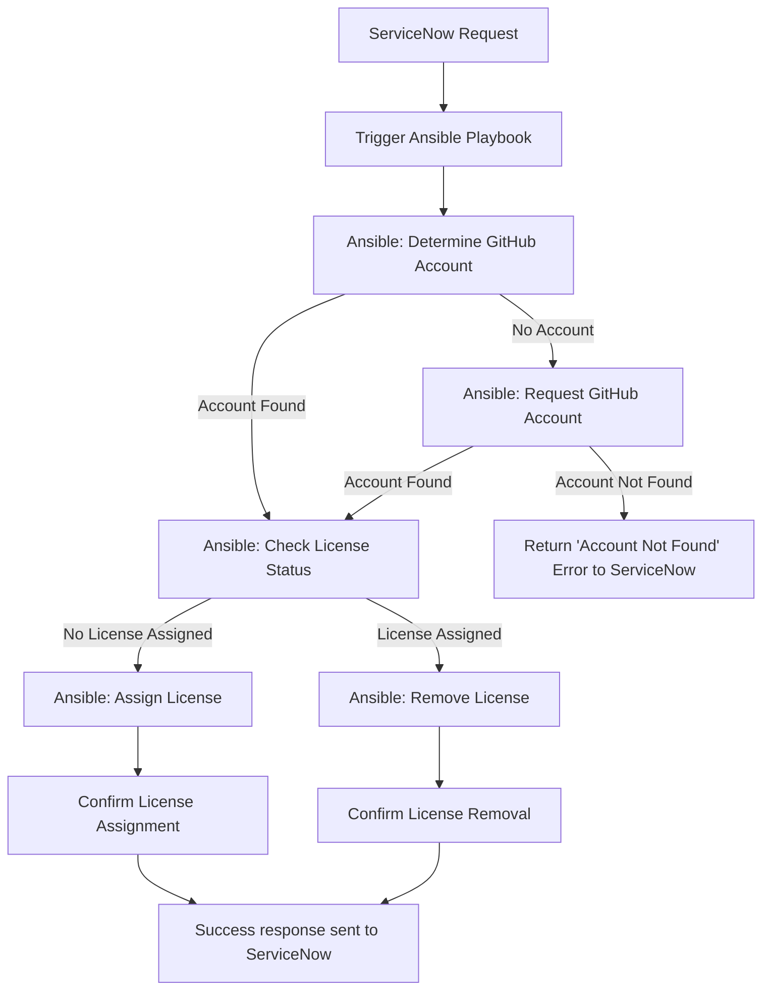

```mermaid
graph TD
    A[ServiceNow Request] --> B[Trigger Ansible Playbook]
    B --> C[Ansible: Determine GitHub Account]
    C -- Account Found --> D[Ansible: Check License Status]
    C -- No Account --> E[Ansible: Request GitHub Account]
    E -- Account Not Found --> F[Return 'Account Not Found' Error to ServiceNow]
    E -- Account Found --> D[Ansible: Check License Status]
    D -- License Assigned --> G[Ansible: Remove License]
    D -- No License Assigned --> H[Ansible: Assign License]
    H --> I[Confirm License Assignment]
    G --> J[Confirm License Removal]
    I --> K[Success response sent to ServiceNow]
    J --> K[Success response sent to ServiceNow]
```