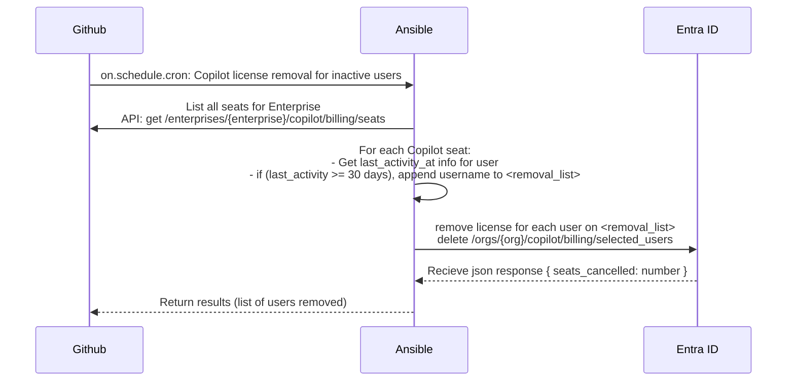

```mermaid
sequenceDiagram
    participant G as Github
    participant A as Ansible
    participant E as Entra ID

    G ->> A: on.schedule.cron: Copilot license removal for inactive users
    A ->> G: List all seats for Enterprise<br>API: get /enterprises/{enterprise}/copilot/billing/seats
    A ->> A: For each Copilot seat:<br>- Get last_activity_at info for user<br>- if (last_activity >= 30 days), append username to <removal_list>
    A->>E: remove license for each user on <removal_list><br>delete /orgs/{org}/copilot/billing/selected_users
    E-->>A: Recieve json response { seats_cancelled: number }
    A -->> G: Return results (list of users removed)
```