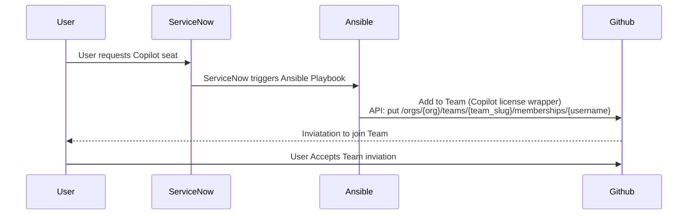

```mermaid
sequenceDiagram
    participant U as User
    participant S as ServiceNow
    participant A as Ansible
    participant G as Github

    U ->> S: User requests Copilot seat
    S ->> A: ServiceNow triggers Ansible Playbook
    A ->> G: Add to Team (Copilot license wrapper)<br>API: put /orgs/{org}/teams/{team_slug}/memberships/{username}
    G -->> U: Inviatation to join Team
    U ->> G: User Accepts Team inviation
```